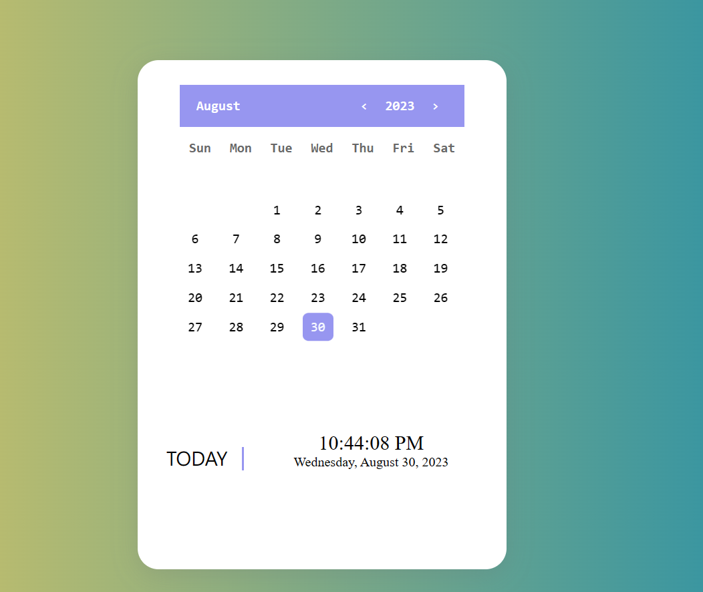

# Calendar Web Application

 The Calendar Web Application is a simple and elegant web-based calendar that allows users to view dates, navigate through months and years, and stay updated with the current date and time. This application is built using HTML, CSS, and JavaScript to provide a user-friendly interface for managing and tracking dates.
# Features

    Month and Year Selection:  Users can easily select a specific month and year using the interactive month and year pickers located in the calendar header.

    Display of Month Grid: The calendar displays a grid of days, arranged by weeks, that correspond to the selected month. Days belonging to the previous and following months are displayed when necessary.

    Current Date Highlight: The current date is highlighted within the calendar, helping users quickly identify today's date.

    Responsive Design: The calendar is designed to be responsive and works well on various screen sizes, from desktop to mobile devices.

    Time and Date Display: The bottom section of the calendar displays the current time and date. The time updates in real-time, providing users with up-to-date information.

    Month List Selection: Users can access a list of months by clicking on the month picker. This list allows for easy navigation to different months.

# Usage

    Month and Year Navigation: Use the left and right arrows (represented as "<" and ">") next to the year to navigate to the previous and next years, respectively.

    Month List: Click on the "May" label to open the month list. Click on any month in the list to quickly navigate to that month.

    Responsive Design: The calendar's responsive design ensures that it looks and functions well on various devices. Test it on desktops, tablets, and mobile phones.

# Demo

